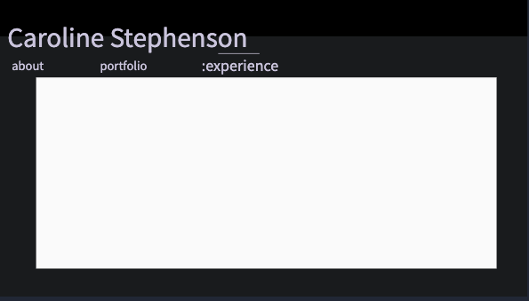
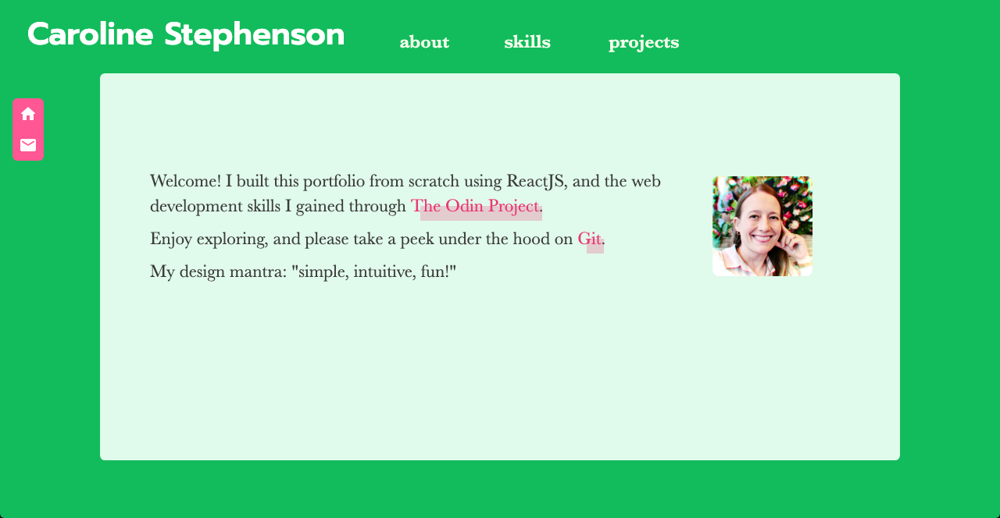

# Portfolio Site

This portfolio site was built in spring 2022 to represent my work learning web development and design over the past year.

## Structure

### File Structure

Each component is organized into folders based on the overall structure of the site:

- **main**: components which form the "spine" of the site and are always in use.
- **main_views**: sub-controllers for displaying changing content as the site is navigated.
- **project**: content components that together display detailed project descriptions.
- **slider**: components controlling the image carousel for projects.
- **shared**: text content files and components used by more than one other component.

Images, screenshots, thumbnails, icons, etc. are housed in a separate **assets** folder

### CSS Structure

All color schemes and element selectors are declared in *index.css*. Each component has its own css file, placed in the same folder as the component. The main div for each component shares the name of its respective component, and each subsequent child element starts with that name. 

The naming convention is: *"ComponentName-element-description"*.

## Development Story

### ReactJS

I embraced the modular structure of ReactJS, and used only functional components to construct the site. Every time I found myself using a shortcut solution to solve a problem, I pushed myself to find a solution that didn't just *work*, but was simple, scalable, and reusable.

### Image Slider

I quickly decided to use a carousel to show off my work. At first I used a library I found online, but quickly became disatisfied as I tried to customize it to my purposes. I had created an image slider for an earlier project, which I repurposed and refined here. While I appreciate all of the resources available through ReactJS, building my own components has been worth it almost every single time.

### Organization

Once I had my main components built, I took the time to organize them into thoughtful category folders. I also decided that it was time to stop cramming all of my CSS into one or two files, and researched the best naming convention for my purposes. It took a while to reorganize, create the files, and refactor the code, but working with my code became so much smoother once I had!

### Content Structure

Text, links and image references are located in files outside of the components, in order to keep the component code cleaner, and to enable easier editing. I'm still ambivalent about this choice, as it made embedding links and non-standard shaped images very difficult.

### Layout

I used [Mockplus](https://www.mockplus.com/) to create a very basic wireframe:

  

While I made some changes as I developed the site, the basic structure held up:

  

### Mobile Development

While I didn't follow mobile-first design principles, this project really helped my develop my media query savvy. I was very pleased with how easy it was to change the layout for mobile with simple changes to my CSS grid-template declarations. CSS Grid wins again! (though Flexbox was perfect for my StickyNav)

### Color Scheme

I started with a very understated black and white color scheme, which I felt would best showcase my colorful portfolio. But as I built the site, I felt it was too austere and didn't really represent me well. I played around with a few options:

- **Blue/Purple**: two of my favorite colors, but blue felt too restrictive/generic, and purple too amateur.
- **Orange**: I love orange, but it didn't look good on my site any more than it looks good on me in real life. Oh how I wish I could wear orange without looking pale and grey :)
- **Olive**: Olive green feels so sophisticated, but in this case it just felt drab.

Finally I played my way into **pink** and **green**, a combination that always makes me happy. In this case, I used watermelons as my inspiration, which hit several of the right notes:

- Summery and cheerful
- Bright but not garish
- Based on colors found in nature
- Soft callback to the eighties
- Full of good memories and positive associations

After I already had the color scheme, I found a nice picture of myself that happened to be in front of a wall of roses that matched the scheme perfectly! Kismet.